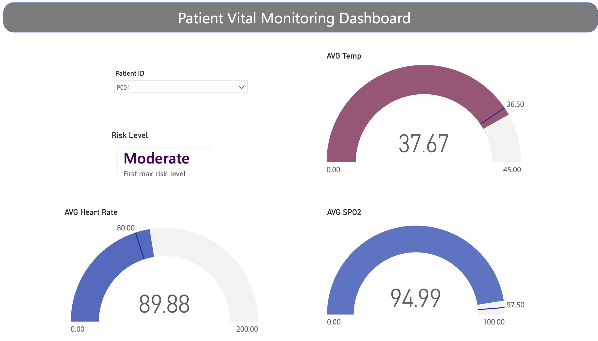

# 🩺 Patient_Vital_Monitoring_GCP  
### From Real-Time Vitals to Clinical Insights: A Cloud-Native Streaming Analytics Pipeline  


---

## 🔍 Project Overview

An **end-to-end real-time patient vital monitoring system** built on **Google Cloud Platform (GCP)** that transforms **streaming physiological data into business-ready analytics** using a **Bronze–Silver–Gold Medallion Architecture**.

This project simulates patient vitals, streams them using **Pub/Sub**, processes them using **Apache Beam on Dataflow**, stores analytics in **BigQuery**, and visualizes insights through **Power BI dashboards**.

---

## 🚀 Key Capabilities

- Real-time patient vital simulation (Python)  
- Pub/Sub based ingestion pipeline  
- Streaming ETL using Apache Beam on Dataflow  
- Medallion Architecture (Bronze, Silver, Gold)  
- Automated data validation & risk scoring  
- Business-ready BigQuery analytics table  
- Power BI clinical monitoring dashboard  
- Secure cross-cloud authentication via Service Accounts  

---

## 🏗️ System Architecture

 

**Flow Overview:**

1. **Simulator** generates live patient vitals
2. **Pub/Sub** ingests streaming events
3. **Dataflow (Apache Beam)** processes data in real time
4. **Cloud Storage** stores Bronze & Silver layers
5. **BigQuery** stores Gold (analytics-ready) data
6. **Power BI** visualizes clinical insights

---

## ☁️ Google Cloud Platform (GCP) Usage

This project leverages multiple **GCP-managed services** to ensure scalability, reliability, and security:

- **Google Pub/Sub** for fault-tolerant event ingestion
- **Apache Beam + Dataflow** for distributed stream processing
- **Google Cloud Storage** for raw and cleaned data layers
- **BigQuery** for low-latency analytical queries
- **Service Accounts & IAM** for secure cross-platform access
- **Cloud Shell** for development and orchestration

The architecture follows **best practices for streaming data pipelines** in production environments.

---
## 🧠 Medallion Data Design

| Layer | Purpose                     | Storage                  |
|--------|------------------------------|---------------------------|
| 🥉 Bronze | Raw event capture            | Google Cloud Storage      |
| 🥈 Silver | Cleaned + Risk Scored        | Google Cloud Storage      |
| 🥇 Gold   | Aggregated analytics         | BigQuery                  |

## 📊 Final Analytics Table (BigQuery)

**Dataset:** `healthcare`  
**Table:** `patient_risk_analytics`

| Column             | Description                     |
|--------------------|----------------------------------|
| `patient_id`       | Patient Identifier               |
| `avg_heart_rate`   | Avg Heart Rate                   |
| `avg_spo2`         | Avg Oxygen Saturation            |
| `avg_temperature` | Avg Body Temperature             |
| `max_risk_level`   | Final Risk Classification        |

## 📊 Power BI Dashboard

### Live Monitoring Includes:

- ✅ Patient Selector (Slicer)  
- ✅ Risk Level Indicator Card  
- ✅ Avg Heart Rate Gauge  
- ✅ Avg Temperature Gauge  
- ✅ Avg SpO₂ Gauge  

This enables **real-time clinical surveillance and triage insights** for patient monitoring.

## 📸 Power BI Dashboard Preview



## 🧰 Technology Stack

| Layer          | Technology                     |
|----------------|--------------------------------|
| Language       | Python 3.9+                    |
| Streaming      | Google Pub/Sub                 |
| Processing     | Apache Beam, Dataflow          |
| Storage        | Google Cloud Storage           |
| Warehouse      | BigQuery                       |
| Visualization  | Power BI                       |
| Authentication | GCP Service Accounts           |


## How to Run the Project

### 1️⃣ Start the Patient Vital Simulator

```bash
cd simulator
export $(grep -v '^#' .env | xargs)
python patient_vital_simulator.py
```

### 2️⃣ Run the Dataflow Medallion Pipeline
```bash
cd dataflow
pip install apache-beam[gcp] python-dotenv 

export $(grep -v '^#' .env | xargs) 

python streaming_medallion_pipeline.py  
--runner DataflowRunner  
--project $GCP_PROJECT  
--region $REGION  
--staging_location $STAGING_LOCATION  
--temp_location $TEMP_LOCATION  
--streaming 
```

## 📁 Project Structure

```text
Patient-Vital-Monitoring-using-GCP/
├── simulator/
│   └── patient_vital_simulator.py
├── dataflow/
│   └── streaming_medallion_pipeline.py
├── README.md
```
🎯 Outcomes

- Successfully streamed and processed live patient vitals
- Built a production-style cloud analytics pipeline
- Implemented Medallion Architecture on GCP
- Enabled real-time clinical dashboards
- Demonstrated scalable, secure, and cloud-native design

🤝 Contributions

Contributions, issues, and suggestions are welcome.
